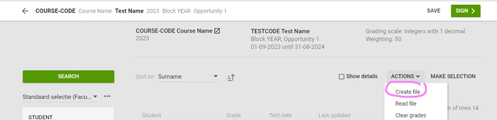
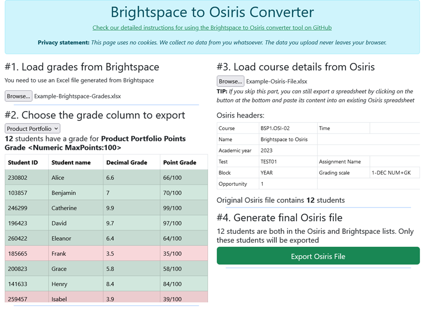

# Brightspace to Osiris Converter tool
 
A simple tool to transfer grades from Excel Spreadsheets generated by the Brightspace Learning Management System into the Osiris grade management system.

## Accessing the Brightspace to Osiris Converter tool

* **Option 1**: Use it online directly at <https://buas-media-interactive.github.io/brightspace-osiris/>
* **Option 2**: Go to **Code** » **Download ZIP** at the top of this page to copy the repository to your computer (works on any operating system) and open the *index.html* file.

In both cases, your data doesn't leave your browser while you are using the tool, so your grades cannot be read by a third party other than Brightspace or Osiris.

## Step by step instructions

### 1. Export the grades in Brightspace

* Go to the course for which you want to export grades, then click on **Course Admin** » **Grades** » **Export**
* Choose the grades you want to export (or select all, this will generate a spreadsheet with multiple columns)
* Click on **Export to Excel** then **Download**

### 2. Export the course/test data in Osiris

* Log in to Osiris and choose "Grade".
* Go to the test item for which you want to enter a grade, then
* Stay logged in and on the same page for the last step!

### 3. Use the Brightspace to Osiris Converter tool

* Go to the Brightspace to Osiris Converter tool (see above for where to find it)
* In box 1, load your **Brightspace spreadsheet**
* In box 2, choose the grade list you want to convert (in case the Brightspace file contained multiple columns)
* In box 3, load your **Osiris spreadsheet**. You can skip this step, but then you will have to manually combine the top of the Osiris file (with course/test codes) and the bottom of the file created in the final step.
* In box 4, click on the green button to generate an Osiris-compatible Spreadsheet

### 4. Upload your grades to Osiris

* Go back to the same screen in Osiris as in step 2
* Now, in the "Actions" menu, choose Read File and upload the file you generated earlier
